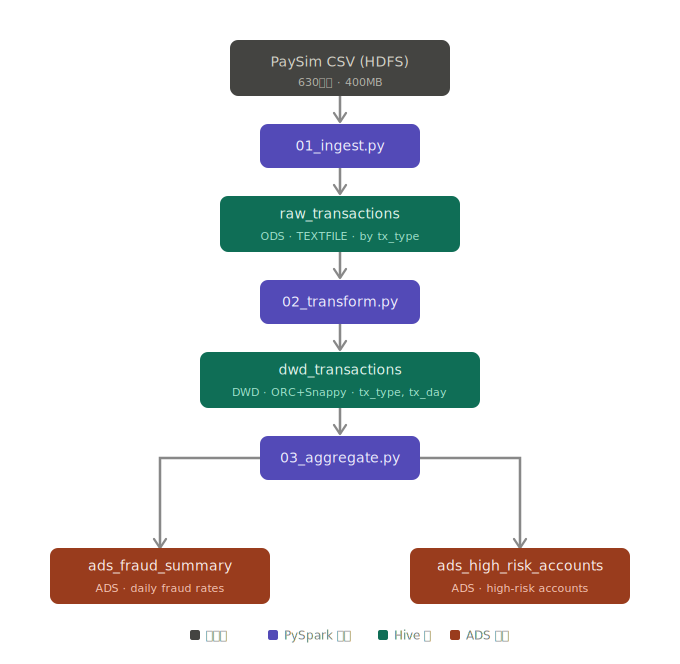

[](https://)
[](https://)
[](https://)
[](https://)

[](https://)
[](https://)

# PaySim Financial Transaction Risk Data Warehouse

An offline data warehouse built with PySpark and Hive for financial transaction fraud analytics, processing 6.36 million simulated transactions across a full ETL pipeline from raw ingestion to aggregated risk reporting.

---

## 1. Pipeline Overview



---

## 2. Dataset

PaySim [1] is a synthetic mobile money transaction dataset generated via agent-based simulation, calibrated against real transaction logs from a mobile financial service. It is designed to exhibit realistic fraud patterns while preserving privacy.

| Property | Value |
|---|---|
| Rows | 6,362,620 |
| Size | ~400 MB CSV |
| Simulation period | 30 days |
| Transaction types | CASH_IN, CASH_OUT, DEBIT, PAYMENT, TRANSFER |
| Fraud records | 8,213 (0.13%, CASH_OUT and TRANSFER only) |

---

## 3. Technical Stack

| Java Component | Version |
|---|---|
| Java | 11.0.30 |
| Hadoop HDFS | 3.3.6 |
| Hive (metastore) [4] | 3.1.3 |
| Spark [3] | 3.5.4 |

| Python Component | Version |
|---|---|
| Python | 3.11.15 |
| PySpark [3] | 3.5.4 |

Storage format： ORC + Snappy [2]

---

## 4. Data Warehouse Layers

| Layer | Table | Format | Partition |
|---|---|---|---|
| ODS | `raw_transactions` | TEXTFILE | `tx_type` |
| DWD | `dwd_transactions` | ORC + Snappy | `tx_type`, `tx_day` |
| ADS | `ads_fraud_summary` | ORC + Snappy | — |
| ADS | `ads_high_risk_accounts` | ORC + Snappy | — |

`raw_transactions` is an EXTERNAL TABLE — dropping it preserves the underlying HDFS data. All other tables are managed.

---

## 5. Feature Engineering (DWD layer)

| Field | Logic | Purpose |
|---|---|---|
| `tx_day` | `tx_hour / 24` | Daily partition key |
| `balance_orig_diff` | `balance_orig_after − balance_orig_before` | Sender balance delta |
| `balance_dest_diff` | `balance_dest_after − balance_dest_before` | Receiver balance delta |
| `is_large_amount` | `amount >= 200,000` | High-value transaction flag |
| `is_balance_zero_out` | `balance_orig_after == 0` | Balance drain flag |

---

## 6. Output Tables

**`ads_fraud_summary`** — daily fraud rate by transaction type

| Field | Description |
|---|---|
| `tx_type` | Transaction type |
| `tx_day` | Day (1–30) |
| `total_cnt` | Total transactions |
| `fraud_cnt` | Confirmed fraud count |
| `fraud_rate` | `fraud_cnt / total_cnt` |

**`ads_high_risk_accounts`** — accounts matching high-risk pattern: large transfer + balance drained

Filter: `is_large_amount = 1 AND is_balance_zero_out = 1 AND tx_type IN ('TRANSFER', 'CASH_OUT')`

| Field | Description |
|---|---|
| `account_orig` | Sender account |
| `tx_type` | Transaction type |
| `risk_tx_cnt` | Qualifying transaction count |
| `total_amount` | Cumulative amount |
| `confirmed_fraud_cnt` | Cross-validation: fraud-labeled count |

Sample output in [`results/`](results/).

---

## 7. Repository Structure

```
paysim-dw/
├── README.md
├── requirements.txt
├── .gitignore
├── pipeline/
│   ├── 01_ingest.py          # HDFS CSV → raw_transactions (ODS)
│   ├── 02_transform.py       # raw → dwd_transactions (DWD, feature engineering)
│   └── 03_aggregate.py       # dwd → ads_fraud_summary + ads_high_risk_accounts
├── ddl/
│   └── create_tables.sql
├── results/
│   ├── fraud_summary.csv
│   └── high_risk_accounts_top50.csv
└── docs/
    └── pipeline_diagram.html
    └── pipeline_diagram.svg
```

---

## 8. Running the Pipeline

Prerequisites: Hadoop HDFS and YARN running, Hive metastore initialized.

```bash
# Start services
start-dfs.sh && start-yarn.sh

# Run pipeline in order
spark-submit pipeline/01_ingest.py
spark-submit pipeline/02_transform.py
spark-submit pipeline/03_aggregate.py
```

All scripts are idempotent — safe to re-run.

---

## 9. Architecture Notes

**Hive CLI replaced by `SparkSession.enableHiveSupport()`** — Hive 3.1 has a known classloader incompatibility with Java 11 (`ClassCastException: AppClassLoader cannot be cast to URLClassLoader`) that cannot be resolved through JVM flags; it is a source-level issue. Routing all DDL and DML through Spark's built-in Hive support is functionally equivalent and avoids the problem entirely.

**Partition order `(tx_type, tx_day)`** — ORC's predicate pushdown [2] prunes files at the directory level before reading any data. Placing `tx_type` as the top-level partition ensures that all business queries filtering by transaction type skip irrelevant partitions at the root of the directory tree. Filtering by `tx_day` alone provides no top-level pruning benefit, as it requires traversal across all `tx_type` subdirectories.

**Derby metastore path pinned to absolute path** — Derby resolves the metastore database path relative to the JVM working directory at startup. Running `spark-submit` from different directories across pipeline stages would cause Derby to create separate, empty metastore instances, losing all table registrations from prior stages. Pinning an absolute path in `spark-defaults.conf` eliminates this drift.

---

## 10. References

[1] Lopez-Rojas, E. A., Elmir, A., & Axelsson, S. (2016). PaySim: A Financial Mobile Money Simulator for Fraud Detection. *The 28th European Modeling and Simulation Symposium (EMSS 2016)*. https://www.kaggle.com/datasets/ealaxi/paysim1

[2] Huai, Y., Chauhan, A., Gates, A., Hagleitner, H., Lee, E. S., O'Malley, O., Radia, J., Shen, N., Shen, X., & Soundararajan, R. (2013). ORC: An ACID-compliant columnar file format for Apache Hive. *Proceedings of the 2013 ACM SIGMOD International Conference on Management of Data*. https://orc.apache.org

[3] Zaharia, M., Xin, R. S., Wendell, P., Das, T., Armbrust, M., Dave, A., Meng, X., Rosen, J., Venkataraman, S., Franklin, M. J., Ghodsi, A., Gonzalez, J., Shenker, S., & Stoica, I. (2016). Apache Spark: A unified engine for big data processing. *Communications of the ACM, 59*(11), 56–65. https://doi.org/10.1145/2934664

[4] Thusoo, A., Sarma, J. S., Jain, N., Shao, Z., Chakka, P., Anthony, S., Liu, H., Wyckoff, P., & Murthy, R. (2009). Hive: A warehousing solution over a map-reduce framework. *Proceedings of the VLDB Endowment, 2*(2), 1626–1629. https://doi.org/10.14778/1687553.1687609
